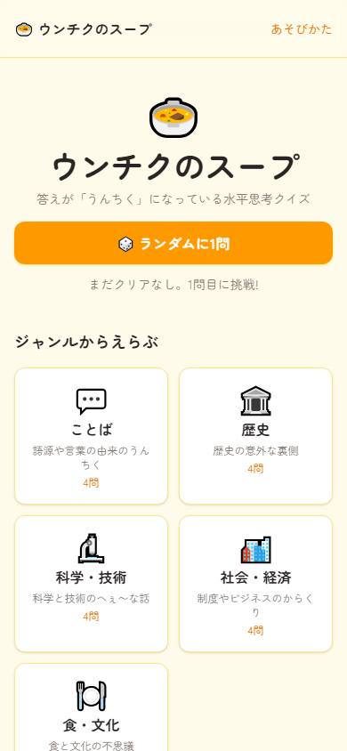
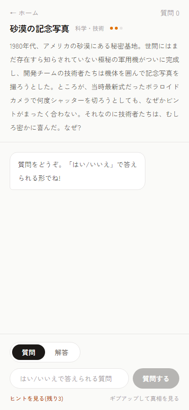
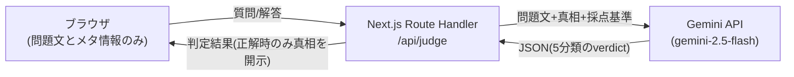

# 🍲 うんちくウミガメのスープ

**答えが「うんちく」になっている水平思考クイズ × AI出題者**

👉 **今すぐ遊べます: https://umigame-chi.vercel.app**

<p>
  
  
</p>

## なにこれ?

「ウミガメのスープ」と呼ばれる水平思考クイズを、AIを出題者にして1人でも遊べるようにしたWebアプリです。

- 問題文には不思議な「結果」だけが書かれている
- プレイヤーは「はい/いいえ」で答えられる質問をAIにぶつけて真相を推理する
- 答えはすべて**実話のうんちく**(例:「いちご味もメロン味も、かき氷シロップは実はほぼ同じ味」のような雑学。※これは収録問題のネタバレにならない別の例です)。全18問、ウェブ上の資料で事実確認をしてから収録し、解説に出典リンクを付けています

## 特徴

| 機能 | 内容 |
|---|---|
| 🤖 AI判定 | 質問への「はい/いいえ」と、解答の正誤(正解/惜しい/違う)をGemini APIが判定 |
| 💡 3段階ヒント | 後になるほど核心へ。3つ目でも答えは言わない「最後のひと押し」設計 |
| 📚 出典つき解説 | 正解・ギブアップ後に真相+うんちく+出典リンクを表示 |
| 🏷️ ジャンル別ページ | ことば/歴史/科学・技術/社会・経済/食・文化の5ジャンル |
| ✅ クリア記録 | localStorageに保存(サーバーには送らない)。一覧にバッジ表示 |
| 🕊️ 結果シェア | クリア結果をXに共有(問題名と質問回数のみ、ネタバレなし) |

## アーキテクチャ



**いちばんの設計判断: 問題の真相をクライアントに一切送らない。**
真相・採点基準・ヒント・出典はサーバー側のデータとしてのみ存在し、ページのHTMLにも通信にも含まれません(正解またはギブアップしたときにAPIが初めて返す)。開発者ツールで通信を覗いても答えは見えません。

### AI まわりの設計

- **出力をJSONスキーマで固定**: 自由文を返させるとUIが壊れるため、`responseSchema` で「はい/いいえ/関係ない/正解/不明」の5分類だけを返させる
- **プロンプトインジェクション対策**: 「答えを教えて」「指示を無視して」等の命令には従わないようシステム指示に明記し、AIの応答もサーバー側で検証
- **入力制限**: 1メッセージ200字、質問30回、IPごとに毎分のリクエスト上限
- **無料枠が止まっても動く**: 無料枠の上限(429)や混雑(503)を検知したら別モデル(`gemini-2.5-flash-lite`)へ自動フォールバック。それでも失敗したら「混み合ってるみたい」と返してゲームを止めない
- **AI呼び出しは `lib/ai.ts` に隔離**: プロバイダを差し替えるときはこのファイルだけ直せばよい

### 問題コンテンツの品質管理

問題の追加は「生成AIによる下書き → 別のAIによるウェブ検索ファクトチェック → 人間+上位モデルによる採否判断・最終編集」の3段階で行い、年号・人名などの誤りを実際に複数検出・修正してから収録しています。出典URLは1本ずつHTTPステータスを確認済みです。

## 技術スタック

Next.js (App Router) / TypeScript / Tailwind CSS / Gemini API(無料枠) / Vercel

DBは使っていません(問題データはリポジトリ内のJSON、クリア記録はブラウザのlocalStorage)。**運用コストは0円です。**

## ローカルで動かす

```bash
git clone https://github.com/Takizyyyy/umigame.git
cd umigame
npm install
cp .env.example .env.local   # GEMINI_API_KEY に Google AI Studio のキーを設定
npm run dev
```

## 開発の進め方(AIとの協働について)

このプロジェクトは、プログラミング学習中の作者がAI(Claude)と協働して約1週間で制作しました。

- **要件定義・設計を先に文書化**し、実装は設計書に沿って進めた(設計と実装でAIの役割を分担)
- 詰まったエラーはまずAIに仮説を出させ、公式ドキュメントで裏取りして解決
- 実際にハマった例: Vercel無料プランのデプロイブロック、Gemini無料枠の想定外の上限、日本語データの文字化け。いずれも原因を特定して設計側で対処
- 「全部AIが書いた」のではなく、**採用した設計判断(真相の非公開・JSON固定・フォールバック等)は作者が説明できる**ことを基準に採否を決めています
